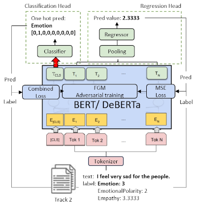

# hyy33 at WASSA 2024 Track 2


This repository presents our scripts and models for the paper
[hyy33 at WASSA 2024 Empathy and Personality Shared Task: Using the CombinedLoss and FGM for Enhancing BERT-based Models in Emotion and Empathy Prediction from Conversation Turns]()
for the workshop [WASSA 2024](https://workshop-wassa.github.io/) collocated with [ACL 2024](https://2024.aclweb.org/).


<p align="center">
    
</p>

> **Figure:** Pre-trained BERT and DeBERTa models are finetuned using the **CombinedLoss** and **FGM** adversarial training for Emotion and Empathy Prediction from Conversation Turns.


## Contents
* [Installation](#scripts)
* [Usage](#scripts)
* [Models](#scripts) 🤗 
* [References](#scripts)

## Installation

Install the related dependencies as follows:

```bash
pip install -r dependencies.txt
```

The pre-trained BERT model could be downloaded at:
[bert-base-uncased](https://huggingface.co/google-bert/bert-base-uncased) 

The pre-trained DeBERTa model could be downloaded at:
[deberta-base](https://huggingface.co/microsoft/deberta-base) 

## Usage
Please proceed with the repository scripts for fine-tuning [BERT](https://arxiv.org/abs/1810.04805) and [DeBERTa](https://arxiv.org/abs/2006.03654) in downstream classification and regression tasks.

* bert-class-fgm-comb.py: fine-tuning BERT on classification task, with FGM and CombinedLoss
* bert-reg-fgm-mse.py: fine-tuning BERT on regression task, with FGM and CombinedLoss
* deberta-class-fgm-comb.py: fine-tuning DeBERTa on classification task, with FGM and CombinedLoss
* deberta-reg-fgm-mse.py: fine-tuning DeBERTa on regression task, with FGM and CombinedLoss

## Models 🤗 
The results of the fine-tuned [model](https://huggingface.co/hyy-33/hyy33-WASSA-2024-Track-2/tree/main) submitted for the Track 2 are as follows:

| Model | Emotion | Emotional Polarity | Empathy | Avg |
|-------|---------|--------------------|---------|-----|
|[hyy-33/hyy33-WASSA-2024-Track-2 🤗](https://huggingface.co/hyy-33/hyy33-WASSA-2024-Track-2/tree/main)       |0.581|0.644| 0.544|0.590|


## References

```bibtex
@article{huiyu2024using_combined_loss_and_fgm,
  title={hyy33 at WASSA 2024 Empathy and Personality Shared Task: Using the CombinedLoss and FGM for Enhancing BERT-based Models in Emotion and Empathy Prediction from Conversation Turns},
  booktitle = "Proceedings of the 14th Workshop on Computational Approaches to Subjectivity, Sentiment, {\&} Social Media Analysis"
  author={Huiyu, Yang and Liting, Huang and Tian, Li and Nicolay, Rusnachenko and Huizhi, Liang},
  year= "2024",
  month= aug,
  address = "Bangkok, Thailand",
}
```
